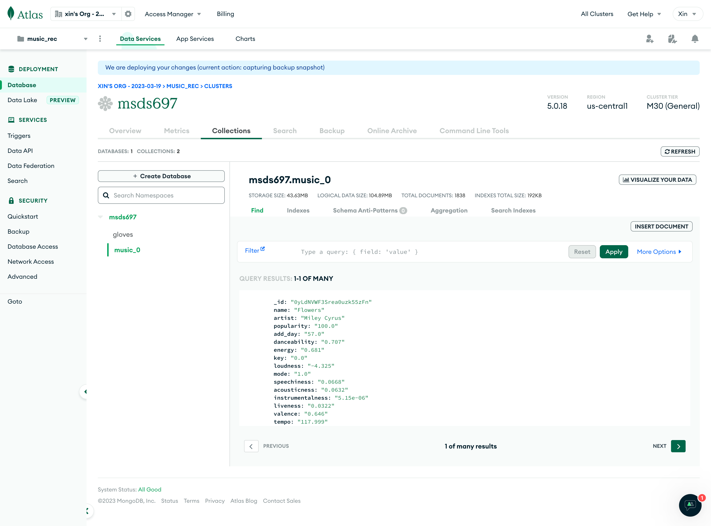
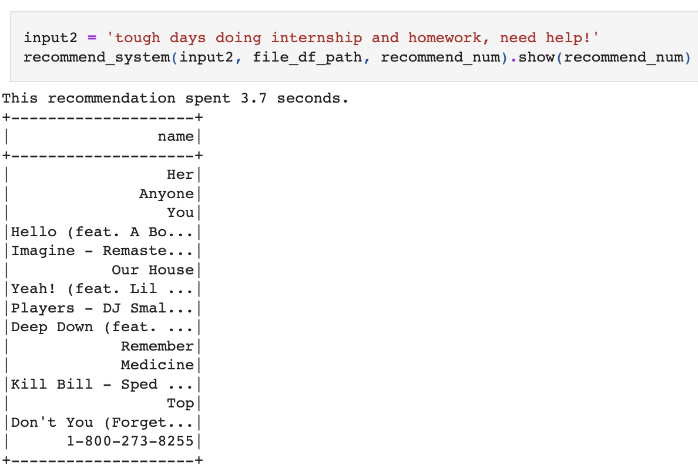

# Music Recommendation System: Personalized Playlist Generation Using Social Media Content

## Intuition
Drawing inspiration from social media music sharing, we've observed that modern individuals frequently use music as a medium for personal expression, enthusiastically sharing and showcasing their preferences. Intriguingly, this implies a reverse correlation as well - the sentiments and language used in song-sharing social media posts can provide significant insights into the character of the songs themselves.

Motivated by this perspective, we are eager to delve deeper into this phenomenon and integrate it into our music recommendation engine. Our goal is to develop a content-based recommendation system, trained on social media content (particularly tweets), capable of generating tailored playlists from any input text. This approach will infuse our music recommendation system with an element of novelty and unexpected delight.

## Steps
### Data Collection Pipeline with Airflow
From February to April, we leveraged Airflow to establish an automated daily data collection pipeline. This allowed us to retrieve popular songs via the Spotify API initially, followed by sourcing tweets that mentioned both the song names and artists, thereby creating a comprehensive and dynamic dataset.
To make certain that our collection included songs with considerable tweet engagement, our focus remained on playlists composed of trending songs or those with the propensity to go viral. These selections span across various genres with a popularity score higher than 60.

- [Spotify - Twitter pipeline](https://github.com/persecond17/Music-Recommendation-System/blob/main/spotify_twitter_calls.py)
- [Implemented the pipeline on Airflow](https://github.com/persecond17/Music-Recommendation-System/blob/main/airflow_st.py)

### Data Storage with Google Cloud Storage (GCP) 
We successfully amassed a dataset comprising **2k songs, 240k tweets, and 84k lyric lines**, securely stored within Google Cloud Platform (GCP). This ensured data reliability and availability to our team from any location while also providing the scalability our operations demanded.

- [GCP Storage Bucket](https://console.cloud.google.com/storage/browser/spotify-twitter)

### Data Consolidation with MongoDB Atlas 
We employ MongoDB Atlas, a highly flexible NoSQL database service, to merge and manage our data. This results in a unified and easily accessible data repository ready for analysis.

- [Read data from GCP to MonglDB (Atlas)](https://github.com/persecond17/Music-Recommendation-System/blob/main/GCS_to_MongoDB.ipynb)

### Data Analysis with Colab & Databricks 
The final stage involves analyzing our consolidated data using Colab and Databricks. These powerful platforms enable us to process large volumes of data and implement our recommendation engine, enhancing the overall music discovery experience for users.

1. Data Filtration: By employing a meticulous filtration process, we eliminate songs with less than 50 related tweets, potential marketing tweets, and their associated lyrics, thus augmenting the precision of our music recommendations.

2. Model - TFIDF: To best represent the relevance of words within our large corpus of data, we have harnessed the power of TFIDF. This methodology merges tweets and lyrics sharing a common song ID from our training set, forming **unique hashing vectors**. For each input text, we convert it into a comparable hashed vector and match it with every song's TFIDF vector, aligning the recommendations with the input's sentiment or topic.

3. Performance Optimization: We've commenced with rigorous testing on a subset of 50 songs from our test set, validating the accuracy of our model. Each song's corresponding tweet corpus is evaluated to ascertain if the target song features among the top 15 recommendations. This rigorous procedure has led to **a high 'top 15 accuracy' of 88%**. 
Additionally, we have optimized our system to promptly create a personalized playlist from any text input, **remarkably reducing the execution time from 75 seconds to just 5-10 seconds, an improvement of 90%.**

- [Model encapsulation](https://github.com/persecond17/Music-Recommendation-System/tree/main/model)
- [Music Recommendation System](https://github.com/persecond17/Music-Recommendation-System/blob/main/music_recommendation_system.ipynb)

